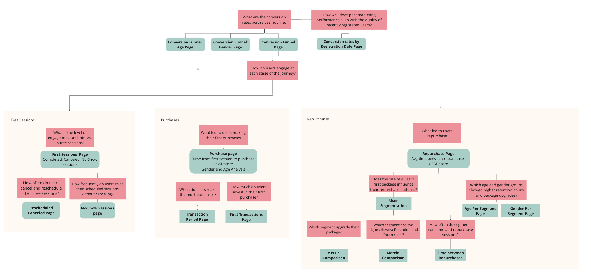

# Booking and Sales Analysis of a Telemedicine App 

## 📌 Table of Contents

1. [Project Overview](#project-overview)  
2. [Key Areas of Analysis](#key-areas-of-analysis)  
3. [Key Facts About the Userbase](#key-facts-about-the-userbase)  
4. [Data Sources](#data-sources)  
5. [Processed & Derived Datasets](#processed--derived-datasets)  
6. [File Structure](#file-structure)  
7. [Key Results](#key-results)
   🔗**Access the summarized results here:** [Link](https://cooing-parsley-1bb.notion.site/Tableau-Dashboard-Key-Results-191ecbc620b480378371f0f9fcd0f766?pvs=4)  


## Project Overview
I interned at a health tech startup that provides a telemedicine app for B2B and B2C clients in Brazil and Canada. The app provides the following services:

- Online consultations with specialists across 12 medical fields
- Easy Access to Doctors' prescriptions
- User diagnosis and prescription history management, enabling seamless and secured data sharing across doctors for holistic treatments

In November 2023, the startup launched its app in Canada, initially offering therapy consultations only. In this new market, business executives and the marketing team lacked quantifiable benchmarks for user booking and purchase behaviors, limiting their ability to make data-driven decisions for resource allocation and marketing campaigns.

To address this, I analyzed data from 2,000 users, including their registrations, session bookings, purchased packages, and payments, to uncover key booking and purchase patterns.

---

## Key Areas of Analysis

- **Conversion Funnel** – Measuring user conversion rates at different user journey stages, including booking rate, first purchase rate, and repurchase rate.  
- **Registration to Booking** – Analyzing the booking rate, the average time between registration and the first session, and behavioral differences across gender and age groups.  
- **First Session Behavior** – Examining free session completion, cancellation, no-show rates, and behavioral differences across gender and age groups.
- **Purchase Patterns** – Analyzing the purchase rate, purchase timings, Return of Investment, and the most purchased session packages. 
- **Repurchase Patterns** – Evaluating repurchase frequency, package upgrade trends, and churn and retention rates across user segments.  

---

## Key Facts About the Userbase

- The analysis focuses on **users who registered in Canada**.  
- Covers registrations and Therapy Sessions from **November 1, 2023 – August 31, 2024**.  
- **All Canadian users receive one free session**, which can be rescheduled **if canceled at least two hours in advance**.  

---

## Data Sources

### Extracted from MySQL Database:
- **Registration Dataset** – User demographic details and registration date.  
- **Appointments Dataset** – All session records up to August 31, 2024.  
- **Doctors Sessions Dataset** – Doctor Id of all sessions up to August 31, 2024.
- **User Credits Dataset** – Users' session credit's status until August 31,2024

### Extracted from NoSQL Database:
- **Payments Dataset** – Transactional records of user purchases.  

---

## Processed & Derived Datasets

The following datasets were cleaned and transformed in **Jupyter Notebook**. These final datasets were imported to Tableau for analysis:

### 1️⃣ Registration Dataset

**Source:** Registration dataset
**Purpose:** Contains basic user information for demographic analysis and user segmentation.
**Processing:** Checked for null values, duplicates, and invalid entries before exporting to Tableau.
**Final Use:** Used for age and gender analysis and as a base dataset for joining transactions.

### 2️⃣ Appointments Dataset

**Source:** Appointments dataset
**Purpose:** Stores all user sessions until the analysis cutoff date (August 31, 2024).
**Processing:**
   - Identified and handled null and duplicated values.
   - Reclassified session_status to distinguish between completed, canceled, and no-show sessions.
   - Created an `is_first_session` column to differentiate free and paid sessions.
**Final Use:** Used for analyzing user session behaviors, cancellations, and free trial engagement.

### 2.1 Cancel Rescheduled Dataset 

**Source:**  Appointments Dataset
**Purpose:** Tracks users who canceled their free session and whether they rescheduled.
**Processing:**
   - Created an `is_valid_cancel` column to classify cancellations as valid or invalid based on the cancellation time.
   - Merged session data with payment data to check if users rescheduled before purchasing a paid session.
   - Created a `has_reschedule` column to indicate whether a user rescheduled their free session.
**Final Use**  Helps measure user engagement with the free trial

### 3️⃣ Purchase Dataset 
**Source:** Payments dataset
**Purpose:**  Stores all user payment transactions.
**Processing:** 
- Created a `package` column that shows the number of sessions purchased by each user
- Created a `purchase_position` column that indicates a purchase's position in all user purchases. It helps identify first-time and repeated purchases.
- Created a `days_between_purchases` column to measure time intervals between purchases.
**Final Use:** Used to analyze user retention, package preference, and purchase patterns.

### 4️⃣ User Status Dataset

**Source:** Appointments and Payments dataset
**Purpose:** Classifies users into status categories based on their last purchase and credit balance as of the analysis cutoff date (August 31, 2024.)
**Processing:**
- Exploratory analysis on days_between_purchases to establish criteria for user status classification.
- Created a `last_purchase_date` column to  track the user's last purchase
- Created a `has_credits` column to identify if the user has remaining session credits.
- Use the new columns to classify the  user's status.
**Final Use:** Used to track retention, churn, and identify users for targeted engagement strategies.


The following image illustrates how the datasets are connected in **Tableau** to generate metrics and visualizations.  

### Data Model 


---

## File Structure
```
/repository
│── notebooks/
│   ├── data_cleaning_transformation.ipynb 
│── images/
│── sql_queries/
    ├── appointments_data_query
    ├── doctors_sessions_data_query
    ├── registration_data_query
    ├── user_credits_data_query
│── README.md
│── requirements.txt   
```

---

## Key Results

The final insights are delivered via a **multi-page Tableau Dashboard**. 

To provide a **clear overview of the Tableau design**, I created a diagram that maps out the **dashboard pages** and the **business questions each page addresses**:



Due to **data confidentiality**, I have compiled a summary of insights and recorded specific dashboard sections in a **Notion Page**.  

🔗**Access the summarized results here:** [Link](https://cooing-parsley-1bb.notion.site/Tableau-Dashboard-Key-Results-191ecbc620b480378371f0f9fcd0f766?pvs=4)  

